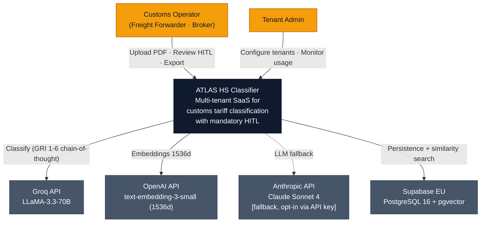
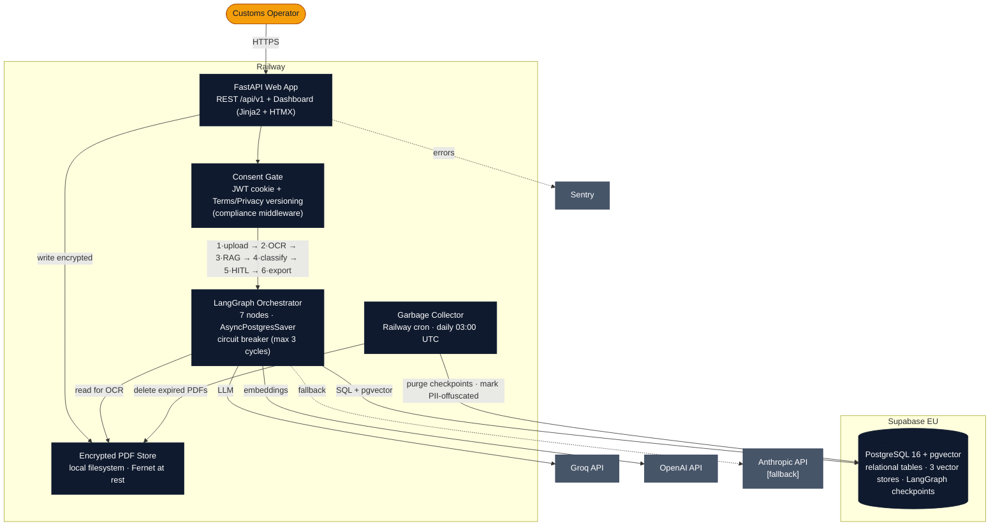
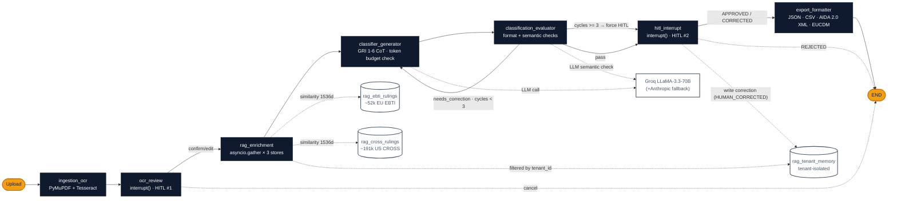

# ATLAS HS Classifier: Architecture

> **Architecture document version**: v0.11.0 (current codebase)
> **Status**: Project in standby (May 2026). Architecture reflects last shipped state.

Architectural documentation following the C4 model (Simon Brown). Diagrams describe **the code as it is**, not the roadmap. Anything planned but not yet implemented (e.g. Stripe billing) is omitted on purpose.

## System Context (C4 Level 1)

ATLAS HS Classifier is a multi-tenant SaaS that automates customs HS code classification for SMEs and freight forwarders. A customs operator uploads a commercial invoice; the system runs OCR → RAG → LLM classification with two mandatory human-in-the-loop steps (OCR review and classification review) and emits an EDI-ready export. Three external LLM/embedding providers are involved. Anthropic is wired in as a fallback but activates only when an API key is configured.

## Containers (C4 Level 2)

The system runs as two Railway services (a FastAPI web container and a scheduled garbage-collector container) backed by a single Supabase project that hosts both the relational tables and three pgvector stores. PDFs never leave the Railway compute boundary: they are Fernet-encrypted on the container's local filesystem and deleted by the GC after the GDPR retention window. Every authenticated HTML request flows through a consent gate that enforces the current Terms (v1.0) and Privacy (v1.1) versions before serving any dashboard route. The LangGraph orchestrator is in-process inside the FastAPI container, with state checkpointed to Postgres at every node boundary.

## Pipeline Components (C4 Level 3)

The LangGraph orchestrator runs **seven nodes** along a linear path broken by two human gates. The first interrupt (`ocr_review`) lets the operator correct OCR extraction before any LLM cost is incurred; the second (`hitl_interrupt`) reviews or corrects the final classification. The `classifier_generator ↔ classification_evaluator` feedback loop is bounded by a circuit breaker at three cycles; beyond that, the state is force-routed to `hitl_interrupt` regardless of the evaluator's verdict, as a last-resort defence against runaway LLM costs. Confirmed corrections are written back to `rag_tenant_memory` (tenant-isolated by `tenant_id`), so the next classification for the same tenant retrieves its own past corrections during RAG enrichment.

## Key Architectural Decisions

1. **HITL is mandatory by default.** `auto_approve_enabled` defaults to `False` in the graph builder. Every classification reaches the `hitl_interrupt` node even at confidence ≥ 0.90 and `RiskLevel.LOW`. The auto-approve branch exists in code but requires per-tenant legal sign-off to enable. Motivation: customs classification errors carry administrative and criminal liability (Art. 303 TULD); the human gate is a legal shield, not a quality knob.

2. **Circuit breaker on the generator-evaluator loop.** `max_validation_cycles = 3`, enforced both inside the `classification_evaluator` node and as a defensive recheck in the post-evaluator routing function. On the third failed evaluation, state is force-routed to HITL. The check runs **before** the evaluator's verdict so a corrupted verdict cannot bypass it. Without this, a stuck evaluator could trigger unbounded LLM calls per session.

3. **Embeddings standardised at 1536 dimensions.** All three vector stores (EBTI, CROSS, tenant memory) use OpenAI `text-embedding-3-small`. A startup probe compares the vector store schema against the configured embedding dimensions and aborts boot on mismatch. Changing the embedding model requires re-indexing ~244k vectors and is a deliberate non-decision for the standby period.

4. **PDFs are ephemeral and locally encrypted.** Uploads land on the Railway container filesystem under a per-tenant, per-session directory, Fernet-encrypted with a single key from `ENCRYPTION_KEY`. They never reach object storage. A separate Railway cron service runs a garbage-collector job daily, deletes files past `DATA_RETENTION_DAYS`, and offuscates PII in derived line items. Motivation: shrink the GDPR blast radius to one provider (Supabase EU) plus one ephemeral disk.

5. **Tenant isolation via filtered vector search.** Queries against `rag_tenant_memory` are always filtered by `tenant_id`, backed by a composite index on that column. Shared stores (EBTI, CROSS) carry no tenant column; they are identical for every tenant. HITL-confirmed corrections are the only tenant-specific RAG content, and they are the progressive lock-in mechanism.

6. **Three-layer cost guardrail.** Layer 1: circuit breaker on cycle count (architectural, never raise the cap). Layer 2: per-tenant daily token budget recorded in the `daily_token_usage` table, checked before every LLM call via a token-budget guard. Layer 3: provider-side spending caps (Groq $50/mo, OpenAI $20/mo). Each layer fails closed.

7. **Consent gate as compliance middleware.** A consent guard on the dashboard router checks `tenant_users.terms_accepted_at` and the version columns against `current_terms_version` (1.0) and `current_privacy_version` (1.1). All authenticated HTML routes redirect to `/dashboard/legal/accept` when versions are out of sync. Bumping a version in settings forces re-acceptance on next login; no migration required.

8. **Two-channel auth, one token format.** Bearer JWT on `/api/v1/*` (programmatic), httpOnly cookie JWT on `/dashboard/*` (browser). The dashboard cookie is `Secure` only outside development environments. No third-party identity provider for MVP; JWT custom is two short files of well-understood code and a future migration to Supabase Auth is intentionally deferred. Note: the admin role exists in the `tenant_users` schema and a dedicated `/api/v1/admin/*` endpoint surface is defined, but admin-only authorization middleware is not yet enforced at the v0.11.0 baseline. Admin gating is a deferred Phase 3 item.

## Tech Stack

| Layer | Technology | Version | Rationale |
|---|---|---|---|
| Language | Python | 3.11+ | Type hints, async-by-default, `from __future__ import annotations` everywhere |
| Orchestration | LangGraph + AsyncPostgresSaver | ≥0.4 / ≥2.0 | StateGraph + checkpointing for HITL `interrupt()` / `Command(resume=...)` |
| Web framework | FastAPI + Uvicorn | ≥0.115 / ≥0.34 | Async, OpenAPI for free, slowapi rate limit middleware |
| Frontend | Jinja2 SSR + HTMX | ≥3.1 | Zero JS build pipeline; HTMX partial swaps for HITL interactions |
| Primary LLM | Groq · `llama-3.3-70b-versatile` | API | Lowest-cost provider serving an open-weights frontier model |
| Fallback LLM | Anthropic · `claude-sonnet-4` | API (opt-in) | Activated only when `ANTHROPIC_API_KEY` is set |
| Embeddings | OpenAI · `text-embedding-3-small` | 1536d | Standardised across all three vector stores |
| Database | PostgreSQL 16 + pgvector | Supabase EU | HNSW indexes (m=16) on all three RAG tables |
| OCR | PyMuPDF + Tesseract | ≥1.25 / OS pkg | Digital PDFs via PyMuPDF; scanned via Tesseract (it+en+de+fr+zh) |
| Auth | JWT (python-jose) + bcrypt | ≥3.3 / passlib ≥1.7 | Custom, two-channel: Bearer (API) + httpOnly cookie (dashboard) |
| Encryption at rest | Fernet (cryptography) | ≥44 | Symmetric, single key from `ENCRYPTION_KEY` env |
| Observability | structlog + Sentry | ≥24.4 / ≥2.19 | JSON logs to stdout; FastAPI + Httpx integrations on Sentry |
| Rate limiting | slowapi | ≥0.1.9 | 60/min default, per IP at the edge |
| Validation | Pydantic v2 + pydantic-settings | ≥2.10 / ≥2.7 | Models cross node boundaries; settings loaded from `.env` |
| Deploy | Railway (FastAPI + cron) | n/a | Two services: web container + scheduled GC at 03:00 UTC daily |
